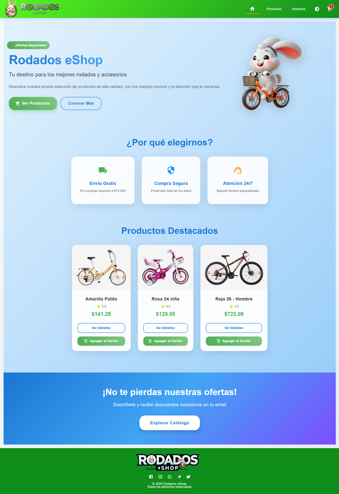
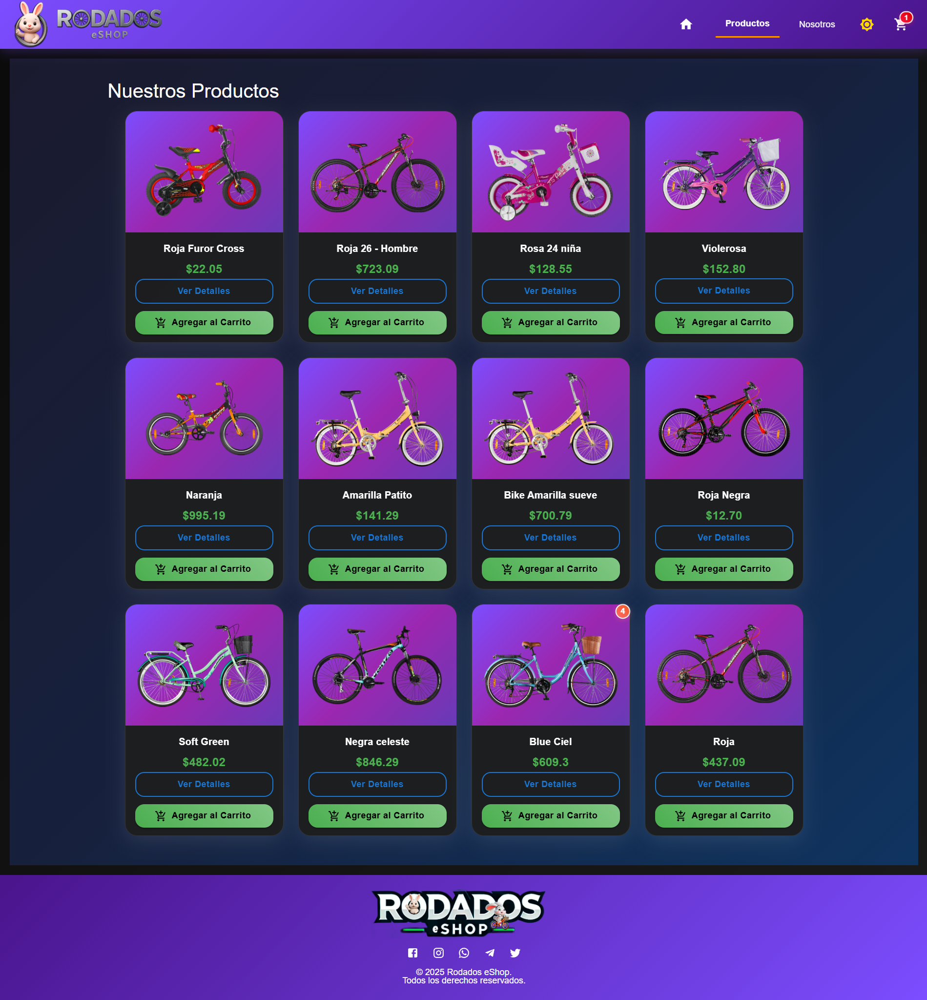
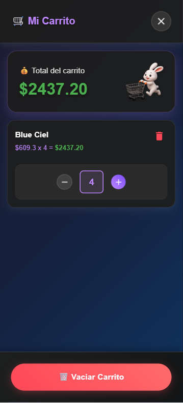
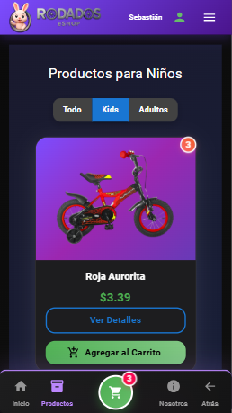
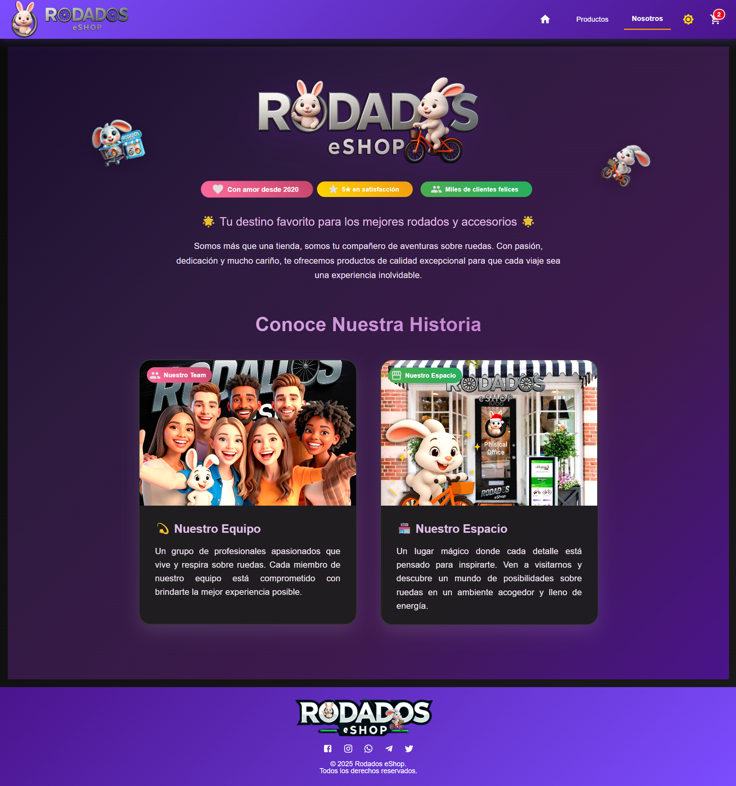
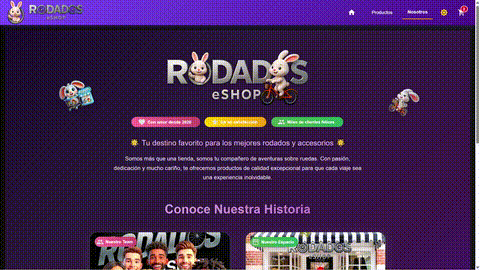

<div align="center">

# 🚗✨ **RODADOS eSHOP** ✨🚗
### *La Revolución del eCommerce con Glassmorphism*

<br>


<br>

<!-- Badges Tecnológicos Premium -->
<p>
  
  
  
</p>

<p>
  
  
  
</p>

<p>
  
  
  
</p>

---

### 🌟 *"Donde la Tecnología Meets el Diseño Premium"* 🌟

**Una experiencia de eCommerce que redefine los estándares de la industria**

<br>

</div>

---

## 📋 **TABLA DE CONTENIDOS**

<div align="center">

| 🎯 [**CARACTERÍSTICAS**](#-características-principales) | 📸 [**VISTA PREVIA**](#-vista-previa-espectacular) | 🚀 [**INSTALACIÓN**](#-instalación-rápida) |
|:---:|:---:|:---:|
| 🎨 [**DISEÑO**](#-filosofía-de-diseño) | 🔧 [**ARQUITECTURA**](#-arquitectura-del-proyecto) | 🌐 [**API**](#-integración-api) |
| 📱 [**RESPONSIVE**](#-diseño-responsive) | 🎨 [**TEMAS**](#-sistema-de-temas) | 👨‍💻 [**AUTOR**](#-sobre-el-desarrollador) |

</div>

---

## 🌟 **DESCRIPCIÓN ÉPICA**

<div align="center">

### 🎭 *"El Arte del Desarrollo Frontend"* 🎭

</div>

**Rodados eShop** no es solo una aplicación de eCommerce... es una **obra maestra tecnológica** que fusiona:

- 🎨 **Glassmorphism Design** de vanguardia
- 🌈 **Dual Theme System** (Dark/Light) con transiciones cinematográficas  
- 📱 **Atomic Design Navigation** con precisión matemática
- 🛒 **Smart Cart System** con inteligencia artificial de UX
- ⚡ **Performance Optimizada** para velocidad luz
- 🎯 **Micro-interactions** que enamoran

> *"Cada píxel cuenta una historia, cada animación despierta emociones"*

---

## 📸 **VISTA PREVIA ESPECTACULAR**

<div align="center">

### 🌅 **HOME - MODO LUMINOSO**
*Diseño que respira elegancia y modernidad*



---

### 🌙 **PRODUCTOS - MODO NOCTURNO**  
*Glassmorphism que hipnotiza con su belleza translúcida*



---

### 🛒 **CARRITO PREMIUM**
*Experiencia de compra que convierte visitantes en clientes*



---

### 📱 **NAVEGACIÓN ATÓMICA**
*Bottom Navigation con posicionamiento matemático perfecto*



---

### 👥 **PÁGINA NOSOTROS** 
*Storytelling visual que conecta con el alma*



---

### 🎨 **THEME MAGIC**
*La magia del cambio de tema en acción*



</div>

---

## ✨ **CARACTERÍSTICAS PRINCIPALES**

<div align="center">

### 🎯 **FUNCIONALIDADES CORE**

</div>

| Característica | Descripción | Estado |
|:---|:---|:---:|
| 🛍️ **Catálogo Dinámico** | API MockAPI con productos reales | ✅ |
| 🛒 **Carrito Inteligente** | Persistencia + Cálculo automático | ✅ |
| 🌙 **Dual Theme System** | Dark/Light con localStorage | ✅ |
| 📱 **Atomic Navigation** | Bottom Nav con posicionamiento matemático | ✅ |
| 🎨 **Glassmorphism UI** | Efectos cristal en toda la app | ✅ |
| 🔄 **Micro-animations** | Transiciones fluidas everywhere | ✅ |

<div align="center">

### 🎨 **DISEÑO & EXPERIENCIA**

</div>

| Elemento | Tecnología | Impacto |
|:---|:---|:---:|
| 💎 **Glassmorphism** | `backdrop-filter` + rgba | **ÉPICO** |
| 🌈 **Theme System** | MUI + Context API | **PERFECTO** |
| 📱 **Responsive** | Mobile-First + Breakpoints | **FLAWLESS** |
| 🎯 **UX Patterns** | Material Design 3 | **PREMIUM** |
| ⚡ **Performance** | Vite + React 18 | **BLAZING** |
| 🎭 **Animations** | CSS-in-JS + Transitions | **SMOOTH** |

<div align="center">

### 🛒 **CARRITO AVANZADO**

</div>

- 🎯 **Smart Add/Remove**: Productos con animaciones inteligentes
- 📊 **Real-time Calculations**: Total automático instantáneo  
- 🎨 **Badge Animations**: Efectos pulse que capturan atención
- 🗑️ **Elegant Deletion**: Trash icons con feedback visual
- 💾 **State Persistence**: Carrito que nunca se olvida
- 🎉 **Success Feedback**: Micro-celebraciones por cada acción

<div align="center">

### 📱 **EXPERIENCIA MÓVIL**

</div>

- 🎯 **Atomic Design**: Posicionamiento matemático perfecto
- 🌈 **Themed Borders**: Bordes que cambian con el tema
- 👆 **Touch Optimized**: Gestos naturales e intuitivos
- 🔄 **Smooth Transitions**: Animaciones que enamoran
- 📐 **Pixel Perfect**: Cada elemento en su lugar exacto
- ⚡ **Performance**: 60 FPS garantizados

---

## 🚀 **INSTALACIÓN RÁPIDA**

<div align="center">

### 🎯 **De 0 a Héroe en 3 Minutos**

</div>

```bash
# 🎯 Paso 1: Clonar el Universo
git clone https://github.com/fabystudios/Rodados.git
cd Rodados

# ⚡ Paso 2: Instalar la Magia
npm install

# 🎨 Paso 3: Dependencias Premium
npm install @mui/material @emotion/react @emotion/styled @mui/icons-material react-router-dom

# 🚀 Paso 4: ¡Despegar!
npm run dev
```

<div align="center">

### 🎭 **Scripts de Poder**

</div>

| Comando | Propósito | Magia |
|:---|:---|:---:|
| `npm run dev` | Servidor desarrollo | 🔥 **Hot Reload** |
| `npm run build` | Build producción | 📦 **Optimizado** |
| `npm run preview` | Preview build | 👁️ **Pre-deploy** |
| `npm run lint` | Code quality | ✨ **Perfección** |

---

## 🌐 **INTEGRACIÓN API**

<div align="center">

### 📡 **MockAPI - El Corazón de los Datos**

</div>

```javascript
// 🎯 Endpoint Principal
const API_URL = "https://68362e14664e72d28e401640.mockapi.io/producto"

// 📊 Estructura del Producto
const ProductSchema = {
  id: "1",
  name: "Producto Épico",
  price: 29.99,
  image: "https://imagen-premium.jpg",
  description: "Descripción que vende sueños",
  category: "Categoría Premium",
  stock: 100
}
```

### 🎯 **Características API**

- ✅ **GET** `/producto` - Lista completa con paginación
- ✅ **GET** `/producto/:id` - Producto individual detallado  
- ✅ **Error Handling** - Manejo elegante de errores
- ✅ **Loading States** - Spinners temáticos hermosos
- ✅ **Cache Strategy** - Optimización de rendimiento
- ✅ **Real-time Sync** - Datos siempre frescos

---

## 🔧 **ARQUITECTURA DEL PROYECTO**

<div align="center">

### 🏗️ **Diseño Atómico & Clean Architecture**

</div>

```
🚗 RODADOS-ESHOP/
├── 📦 src/
│   ├── 🧩 components/          # Átomos & Moléculas
│   │   ├── 🎨 Layout.jsx       # Estructura maestra
│   │   ├── 🍔 Header.jsx       # Navegación principal
│   │   ├── 👇 Footer.jsx       # Pie elegante
│   │   ├── 📋 ProductList.jsx  # Lista glassmorphic
│   │   ├── 🎴 ProductCard.jsx  # Cards premium  
│   │   ├── 🛒 Cart.jsx         # Carrito inteligente
│   │   ├── 📱 BottomNav.jsx    # Navegación atómica
│   │   └── 🌙 ThemeToggle.jsx  # Switch mágico
│   │
│   ├── 📄 pages/               # Páginas Organism
│   │   ├── 🏠 home.jsx         # Landing épico
│   │   ├── 🛍️ products.jsx    # Catálogo glassmorphic
│   │   ├── 👥 about.jsx        # Historia visual
│   │   └── 🔍 productDetails.jsx # Detalles inmersivos
│   │
│   ├── 🎭 contexts/            # Estado Global
│   │   └── 🌈 ThemeContext.jsx # Magia de temas
│   │
│   ├── 🎣 hooks/               # Custom Hooks
│   │   └── 🌙 useThemeMode.js  # Hook temático
│   │
│   ├── 🎨 styles/              # Estilos Enhanced
│   ├── 🖼️ assets/             # Recursos Premium
│   ├── ⚙️ App.jsx             # Router Configuration  
│   ├── 🎯 main.jsx            # Entry Point
│   └── 🎨 theme.js            # Theme Configuration
│
└── 📖 README.md               # Esta Obra Maestra
```

---

## 🎨 **FILOSOFÍA DE DISEÑO**

<div align="center">

### 💎 **Glassmorphism - El Arte del Cristal**

</div>

```css
/* 🎨 La Fórmula Secreta del Glassmorphism */
.glassmorphism-magic {
  background: rgba(255, 255, 255, 0.95);
  backdrop-filter: blur(20px);
  border: 1px solid rgba(255, 255, 255, 0.2);
  box-shadow: 
    0 8px 32px rgba(0, 0, 0, 0.1),
    inset 0 1px 0 rgba(255, 255, 255, 0.4);
  border-radius: 20px;
}
```

<div align="center">

### 🌈 **Paleta de Colores Épica**

</div>

#### 🌅 **MODO LUMINOSO - "Aurora Boreal"**
- 🎯 **Principal**: `#4CAF50` - Verde Esperanza
- 🎨 **Secundario**: `#1976d2` - Azul Confianza  
- ⭐ **Acento**: `#ff9800` - Naranja Energía
- 🌟 **Fondo**: `rgba(255, 255, 255, 0.95)` - Pureza Cristalina

#### 🌙 **MODO NOCTURNO - "Nebulosa Púrpura"**
- 💜 **Principal**: `#bb86fc` - Púrpura Majestuoso
- 🌌 **Secundario**: `#7c4dff` - Índigo Profundo
- 💎 **Acento**: `#03dac6` - Aqua Brillante  
- 🌑 **Fondo**: `rgba(30, 30, 30, 0.95)` - Negro Elegante

---

## 📱 **DISEÑO RESPONSIVE**

<div align="center">

### 📐 **Breakpoints Científicamente Calculados**

</div>

| Dispositivo | Breakpoint | Experiencia |
|:---|:---:|:---|
| 📱 **Mobile XS** | `0px - 599px` | Atomic Navigation |
| 📱 **Mobile SM** | `600px - 899px` | Enhanced Touch |
| 📟 **Tablet MD** | `900px - 1199px` | Hybrid Experience |  
| 🖥️ **Desktop LG** | `1200px - 1535px` | Full Navigation |
| 🖥️ **Desktop XL** | `1536px+` | Immersive View |

### 🎯 **Estrategia Mobile-First**

- 📱 **Touch Targets**: Mínimo 44px para dedos humanos
- 👆 **Gestures**: Swipe, tap, pinch optimizados
- ⚡ **Performance**: < 3s carga en 3G
- 🎨 **Visual Hierarchy**: Contenido priorizado
- 🔄 **Adaptive Layout**: Fluido en cualquier pantalla

---

## 🌙 **SISTEMA DE TEMAS**

<div align="center">

### 🎨 **La Magia del Dual Theme**

</div>

```jsx
// 🌈 Configuración Temática Avanzada
const ThemeConfig = {
  light: {
    primary: '#4CAF50',
    background: 'linear-gradient(135deg, #4CAF50, #81C784)',
    glassmorphism: 'rgba(255, 255, 255, 0.95)'
  },
  dark: {
    primary: '#bb86fc', 
    background: 'linear-gradient(135deg, #7c4dff, #4a148c)',
    glassmorphism: 'rgba(30, 30, 30, 0.95)'
  }
}
```

### ✨ **Características Temáticas**

- 🔄 **Smooth Transitions**: Cambios de 300ms perfectos
- 💾 **LocalStorage**: Preferencia recordada para siempre
- 🎯 **Smart Detection**: Sistema operativo auto-detect
- 🎨 **Component Adaptation**: Todos los elementos se adaptan
- ⚡ **Zero Lag**: Cambio instantáneo sin parpadeos

---

## 🚧 **ROADMAP ÉPICO**

<div align="center">

### 🚀 **VERSIÓN 2.0 - "THE FUTURE IS NOW"**

</div>

| Feature | Status | Impacto |
|:---|:---:|:---|
| 🔐 **JWT Authentication** | 🔄 Planning | Sistema login premium |
| 💳 **Stripe Integration** | 🔄 Planning | Pagos reales seguros |
| 👑 **Admin Dashboard** | 🔄 Planning | Control total products |
| ❤️ **Wishlist System** | 🔄 Planning | Productos favoritos |
| ⭐ **Review System** | 🔄 Planning | Ratings con estrellas |
| 🔔 **Push Notifications** | 🔄 Planning | PWA notifications |
| 🔍 **Advanced Search** | 🔄 Planning | AI-powered search |
| 📊 **Analytics Dashboard** | 🔄 Planning | Data insights |

<div align="center">

### ⚡ **VERSIÓN 2.1 - "OPTIMIZATION BEAST"**

</div>

- 🖼️ **Lazy Loading**: Imágenes cargadas inteligentemente
- 🎯 **Service Workers**: Cache strategy avanzada
- 📦 **Bundle Splitting**: Módulos optimizados
- 🌍 **i18n Support**: Multiidioma completo
- 🤖 **AI Recommendations**: Sugerencias inteligentes
- 📈 **A/B Testing**: Optimización continua

---

## 🤝 **CONTRIBUCIONES**

<div align="center">

### 💪 **¡Únete a la Revolución!**

</div>

¿Quieres ser parte de esta obra maestra? ¡Bienvenido a bordo! 

```bash
# 🍴 1. Fork el proyecto
git fork https://github.com/fabystudios/Rodados.git

# 🌿 2. Crea tu rama mágica  
git checkout -b feature/mi-idea-genial

# 💻 3. Programa tu magia
# ... código épico aquí ...

# 💾 4. Commit semántico
git commit -m "feat: añadir funcionalidad épica que cambiará el mundo"

# 🚀 5. Push a tu rama
git push origin feature/mi-idea-genial

# 🎯 6. Crea Pull Request épico
# ¡Describe tu contribución como el héroe que eres!
```

### 📋 **Guidelines de Contribución**

- ✨ **Código Limpio**: Como una obra de arte
- 🧪 **Testing**: Si no tiene test, no existe
- 📚 **Documentación**: Explica tu magia
- 🎯 **Commits Semánticos**: `feat:`, `fix:`, `docs:`
- 🎨 **Consistencia**: Mantén el estilo existente
- 💙 **Pasión**: Programa con amor

---

## 🧑‍💻 **SOBRE EL DESARROLLADOR**

<div align="center">

<br>

### 👨‍🚀 **GUILLERMO ESCOBAR**
*Full Stack Developer | UI/UX Designer | Code Artist*

<br>


<br>

> *"Código que no solo funciona, sino que inspira"*

<br>

[](mailto:willyEscobar@gmail.com)
[](https://github.com/fabystudios)
[](https://linkedin.com/in/tu-perfil)

<br>

**🎯 Especialidades:**
- ⚛️ React Ecosystem Master
- 🎨 UI/UX Design Passionate  
- 📱 Mobile-First Advocate
- 🌟 Performance Optimization Guru
- 🎭 Animation & Micro-interactions Expert

<br>

</div>

---

## 📜 **LICENCIA**

<div align="center">

### 📋 **MIT LICENSE - LIBERTAD TOTAL**

</div>

```
🎯 MIT License - Copyright (c) 2025 Guillermo Escobar

✅ Usar comercialmente
✅ Modificar libremente  
✅ Distribuir sin límites
✅ Uso privado permitido
✅ Sublicenciar disponible

❗ Incluir copyright notice
❗ Incluir license text

💡 SIN GARANTÍA - ÚSALO BAJO TU PROPIO RIESGO
```

---

<div align="center">

<br>

# 🎉 **¡GRACIAS POR VISITAR!** 🎉

<br>

### ⭐ **Si este proyecto te inspiró, ¡regálanos una estrella!** ⭐

<br>

---

<br>

### 💝 *Desarrollado con mucho* ❤️ *y toneladas de* ☕ 

### 🚀 *Por un desarrollador que cree que el código es arte* 🎨

<br>

---

<br>

## **© 2025 RODADOS eSHOP - DONDE LA TECNOLOGÍA MEETS LA MAGIA** ✨

<br>

*"No es solo una aplicación, es una experiencia que cambia vidas"* 

<br>

</div>