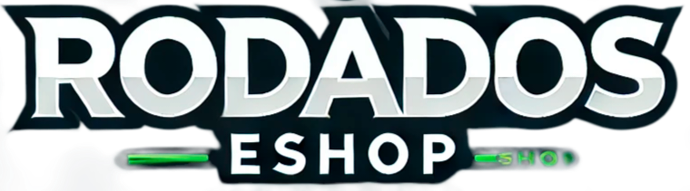
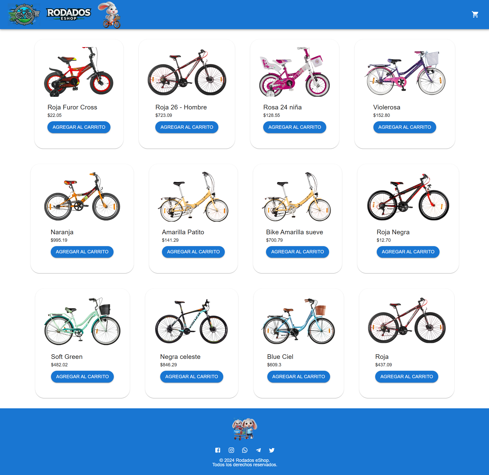
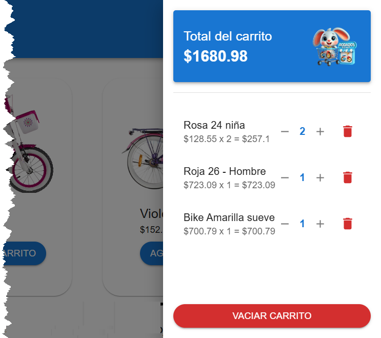

# 🛍️ React eCommerce App Talento Techo 2do cuat 2025


Una **aplicación de eCommerce moderna** construida con [React](https://reactjs.org/), [Vite](https://vitejs.dev/), y [Material UI](https://mui.com/).  
Incluye un **catálogo de productos** consumidos desde una API externa y un **carrito de compras dinámico** con un diseño inspirado en **Material Design 3 (MD3)**.  
<!-- ## 📑 Índice

- [✨ Características](#-características)
- [📸 Vista previa](#-vista-previa)
- [🚀 Instalación y uso](#-instalación-y-uso)
- [🌐 API de productos](#-api-de-productos)
- [📂 Estructura del proyecto](#-estructura-del-proyecto)
- [🧑‍💻 Autor](#-autor)
- [📝 Licencia](#-licencia) -->
---


## ✨ Características

✅ Catálogo de productos obtenido desde **MockAPI**  
✅ Diseño elegante con **Material UI (MUI v5)**  
✅ **Carrito lateral (Drawer)** que se puede abrir/cerrar  
✅ Al agregar un producto repetido, **aumenta la cantidad automáticamente**  
✅ Cálculo dinámico del **total del carrito**  
✅ Botón para **vaciar todo el carrito**  
✅ Botón 🗑️ rojo para eliminar productos individuales  
✅ Estilo moderno y transiciones suaves con **hover effects**

---

## 📸 Vista previa

### 🖥️ Catálogo de productos


### 🛒 Carrito lateral


---

## 🚀 Instalación y uso

Clona el repositorio y ejecuta los siguientes pasos:

```bash
# 1. Crear el proyecto con Vite (si no lo hiciste aún)
npx create-vite@latest my-ecommerce --template react

# 2. Instalar dependencias
cd my-ecommerce
npm install

# 3. Instalar Material UI
npm install @mui/material @emotion/react @emotion/styled @mui/icons-material

# 4. Iniciar el servidor de desarrollo
npm run dev
```

# 🌐 API de productos

Los productos se consumen desde la API pública de MockAPI
:

👉 https://68362e14664e72d28e401640.mockapi.io/producto

Ejemplo de producto:

```bash
{
  "id": "1",
  "name": "Camiseta React",
  "price": 29.99,
  "image": "https://via.placeholder.com/200"
}
```

# 📂 Estructura del proyecto

```bash

src/
 ├── components/
 │    ├── Layout.jsx         # Estructura principal (Header, Body, Footer, Sidebar)
 │    ├── Header.jsx         # Barra superior con título
 │    ├── Footer.jsx         # Pie de página
 │    ├── ProductList.jsx    # Lista de productos desde API
 │    ├── Cart.jsx           # Carrito lateral con total y botones
 │
 ├── styles/
 │    └── ProductList.css    # Estilos adicionales
 │
 ├── App.jsx                 # Punto de entrada de la app
 └── main.jsx                # Renderización principal con ReactDOM

```
# 🧑‍💻 Autor

👤 Guillermo Escobar

📧 Contacto: willyEscobar@gmail.com

<!-- 🌐 Portfolio: tu-portfolio.com -->

📝 Licencia: 
Este proyecto se publica bajo la licencia MIT.
Eres libre de usarlo, modificarlo y adaptarlo a tus necesidades. 🎉


 # 🛍️ React eCommerce App


