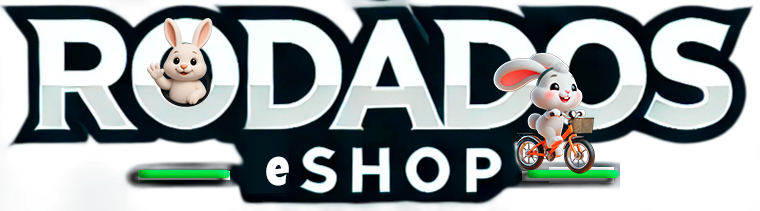
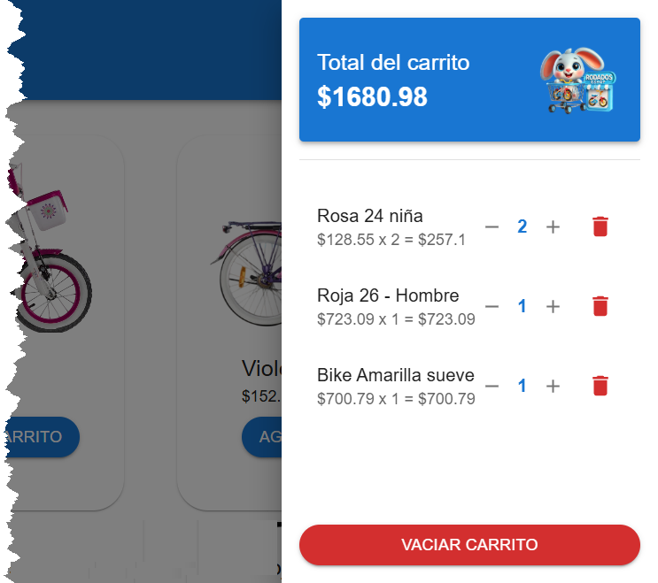

# � Rodados eShop - Tienda Virtual Premium

<div align="center">
  
</div>

<div align="center">
  
  
  
  
  
  
  
</div>

---

## 🌟 Descripción

**Rodados eShop** es una aplicación de eCommerce de última generación, completamente desarrollada con las tecnologías más modernas del ecosistema React. Combina un diseño **Glassmorphism** elegante con un sistema de temas **Dark/Light Mode** completo, navegación móvil **Atomic Design** y una experiencia de usuario excepcional.

### 🎨 **Diseño Premium**
- **Glassmorphism UI**: Efectos de cristal translúcido con `backdrop-filter`
- **Tema Dual**: Sistema completo Dark/Light con persistencia localStorage
- **Gradientes Adaptativos**: Colores que cambian según el tema activo
- **Navegación Atómica**: Bottom Navigation móvil con posicionamiento matemático

### 🛠️ **Tecnologías de Vanguardia**
- **React 18** con Hooks modernos (useState, useEffect, useTheme)
- **Material-UI v5** con sistema de theming avanzado
- **React Router** para navegación SPA
- **MockAPI** para consumo de datos reales
- **CSS-in-JS** con styled-components

---

## ✨ Características Principales

### 🎯 **Funcionalidades Core**
✅ **Catálogo de Productos** con API real (MockAPI)  
✅ **Carrito de Compras** inteligente con persistencia  
✅ **Sistema de Temas** Dark/Light con toggle animado  
✅ **Navegación Móvil** con Atomic Design principles  
✅ **Páginas Dinámicas**: Home, Productos, Detalles, About  
✅ **Búsqueda y Filtros** de productos avanzados  

### 🎨 **Diseño y UX**
✅ **Glassmorphism Design** en todas las interfaces  
✅ **Animaciones Fluidas** y micro-interacciones  
✅ **Responsive Design** Mobile-First  
✅ **Iconografía Consistente** con Material Icons  
✅ **Feedback Visual** con badges animados  
✅ **Loading States** con spinners temáticos  

### 📱 **Experiencia Móvil**
✅ **Bottom Navigation** con posicionamiento atómico  
✅ **Drawer Menu** con gradientes adaptativos  
✅ **Touch Gestures** optimizados  
✅ **PWA Ready** para instalación móvil  

### 🛒 **Carrito Avanzado**
✅ **Agregar/Quitar** productos con animaciones  
✅ **Cantidades Dinámicas** con contadores inteligentes  
✅ **Total Automático** con cálculos en tiempo real  
✅ **Vaciar Carrito** con confirmación elegante  
✅ **Badges Animados** con efectos pulse  

### 🌈 **Sistema de Temas**
✅ **Modo Claro**: Gradientes verdes vibrantes  
✅ **Modo Oscuro**: Paleta púrpura/índigo  
✅ **Transiciones Suaves** entre temas  
✅ **Persistencia** con localStorage  
✅ **Componentes Adaptativos** automáticos

---

## 📸 Vista Previa

### 🌅 **Modo Claro - Home**


### 🌙 **Modo Oscuro - Glassmorphism**
*Interfaz con efectos de cristal translúcido y gradientes púrpura*

### 📱 **Navegación Móvil Atómica**
*Bottom Navigation con posicionamiento matemático y bordes temáticos*

### 🛒 **Carrito Premium**


---

## 🚀 Instalación y Configuración

### **Requisitos Previos**
- Node.js 16+ 
- npm o yarn
- Git

### **Pasos de Instalación**

```bash
# 1. Clonar el repositorio
git clone https://github.com/tu-usuario/rodados-eshop.git
cd rodados-eshop

# 2. Instalar dependencias
npm install

# 3. Instalar dependencias adicionales de MUI
npm install @mui/material @emotion/react @emotion/styled 
npm install @mui/icons-material @mui/lab

# 4. Instalar React Router
npm install react-router-dom

# 5. Iniciar servidor de desarrollo
npm run dev
```

### **Scripts Disponibles**
```bash
npm run dev        # Servidor de desarrollo
npm run build      # Build para producción
npm run preview    # Preview del build
npm run lint       # Linter ESLint
```

---

## 🌐 API Integration

### **MockAPI - Productos**
Los productos se consumen desde MockAPI en tiempo real:

**Endpoint:** `https://68362e14664e72d28e401640.mockapi.io/producto`

**Estructura del Producto:**
```json
{
  "id": "1",
  "name": "Producto Premium",
  "price": 29.99,
  "image": "https://example.com/image.jpg",
  "description": "Descripción detallada",
  "category": "Categoría",
  "stock": 10
}
```

### **Características API**
- ✅ **GET** `/producto` - Listado completo
- ✅ **GET** `/producto/:id` - Producto individual
- ✅ **Paginación** automática
- ✅ **Error Handling** con fallbacks
- ✅ **Loading States** integrados

---

## 📂 Arquitectura del Proyecto

```
src/
├── components/           # Componentes reutilizables
│   ├── Layout.jsx        # Layout principal con theming
│   ├── Header.jsx        # Header responsivo con drawer
│   ├── Footer.jsx        # Footer con gradientes adaptativos  
│   ├── ProductList.jsx   # Lista con glassmorphism cards
│   ├── ProductCard.jsx   # Card individual de producto
│   ├── Cart.jsx          # Carrito con diseño premium
│   ├── SidebarCart.jsx   # Drawer del carrito
│   ├── BottomNavigation.jsx # Navegación móvil atómica
│   └── ThemeToggle.jsx   # Switch de temas animado
│
├── pages/                # Páginas de la aplicación
│   ├── home.jsx          # Página principal con API
│   ├── products.jsx      # Catálogo con glassmorphism
│   ├── about.jsx         # Sobre nosotros con animaciones
│   └── productDetails.jsx # Detalles con modal gallery
│
├── contexts/             # Context API
│   └── ThemeContext.jsx  # Manejo de estado de temas
│
├── hooks/                # Custom Hooks
│   └── useThemeMode.js   # Hook para theme switching
│
├── styles/               # Estilos adicionales
│   ├── Footer.css
│   └── ProductList.css
│
├── assets/               # Recursos estáticos
│   ├── brand.png
│   ├── logo-ppal.png
│   └── ...
│
├── App.jsx               # Configuración de rutas
├── main.jsx              # Entry point con providers
└── theme.js              # Configuración de temas MUI
```

---

## 🎨 Guía de Diseño

### **Paleta de Colores**

#### 🌅 **Modo Claro**
- **Principal:** `#4CAF50` (Verde vibrante)
- **Secundario:** `#1976d2` (Azul material)
- **Acento:** `#ff9800` (Naranja energético)
- **Fondo:** `rgba(255, 255, 255, 0.95)` (Blanco translúcido)

#### 🌙 **Modo Oscuro**  
- **Principal:** `#bb86fc` (Púrpura elegante)
- **Secundario:** `#7c4dff` (Índigo profundo)
- **Acento:** `#03dac6` (Aqua brillante)
- **Fondo:** `rgba(30, 30, 30, 0.95)` (Negro translúcido)

### **Efectos Glassmorphism**
```css
background: rgba(255, 255, 255, 0.95);
backdrop-filter: blur(10px);
border: 1px solid rgba(255, 255, 255, 0.3);
box-shadow: 0 8px 32px rgba(0, 0, 0, 0.1);
```

---

## 📱 Responsive Design

### **Breakpoints**
- **xs:** `0px` - Móviles pequeños
- **sm:** `600px` - Móviles grandes  
- **md:** `900px` - Tablets
- **lg:** `1200px` - Desktop
- **xl:** `1536px` - Desktop grande

### **Navegación Adaptativa**
- **Desktop:** Header con menú horizontal
- **Mobile:** Bottom Navigation + Drawer Menu
- **Atomic Positioning:** Distribución matemática perfecta

---

## 🔧 Personalización

### **Cambiar Temas**
```jsx
// En theme.js
export const createCustomTheme = (mode) => 
  createTheme({
    palette: {
      mode,
      primary: { main: mode === 'dark' ? '#tu-color' : '#tu-color' }
    }
  });
```

### **Agregar Nuevas Páginas**
```jsx
// En App.jsx
<Route path="/nueva-pagina" element={<TuComponente />} />
```

### **Personalizar Glassmorphism**
```jsx
// En styled components
background: theme.palette.mode === 'dark' 
  ? 'rgba(30, 30, 30, 0.95)' 
  : 'rgba(255, 255, 255, 0.95)',
backdropFilter: 'blur(10px)'
```

---

## 🚧 Roadmap Futuro

### **V2.0 - Próximas Características**
- [ ] **Autenticación** con JWT
- [ ] **Pagos Integrados** (Stripe/PayPal)
- [ ] **Panel Administrativo** para productos
- [ ] **Wishlist** con corazones animados
- [ ] **Reviews y Ratings** con estrellas
- [ ] **Notificaciones Push** PWA
- [ ] **Filtros Avanzados** con facetas
- [ ] **Comparador** de productos
- [ ] **Chat en Vivo** con WebSocket
- [ ] **Multiidioma** (i18n)

### **V2.1 - Optimizaciones**
- [ ] **Lazy Loading** de imágenes
- [ ] **Service Workers** para cache
- [ ] **Bundle Splitting** avanzado
- [ ] **SEO Optimization** con meta tags
- [ ] **Analytics** integrado
- [ ] **A/B Testing** framework

---

## 🤝 Contribuciones

¡Las contribuciones son bienvenidas! Por favor:

1. **Fork** el proyecto
2. Crea tu **feature branch** (`git checkout -b feature/AmazingFeature`)
3. **Commit** tus cambios (`git commit -m 'Add some AmazingFeature'`)
4. **Push** a la branch (`git push origin feature/AmazingFeature`)
5. Abre un **Pull Request**

### **Guías de Contribución**
- Mantén el estilo de código consistente
- Añade tests para nuevas funcionalidades  
- Actualiza la documentación
- Sigue las convenciones de commits semánticos

---

## 🧑‍💻 Autor

<div align="center">
  
  
  **Guillermo Escobar**  
  *Full Stack Developer & UI/UX Designer*
  
  [](mailto:willyEscobar@gmail.com)
  [](https://linkedin.com/in/tu-perfil)
  [](https://github.com/tu-usuario)
</div>

---

## � Licencia

Este proyecto está licenciado bajo la **Licencia MIT** - consulta el archivo [LICENSE](LICENSE) para más detalles.

```
MIT License - Eres libre de usar, modificar y distribuir este código.
Incluye atribución al autor original. ¡Disfruta construyendo! 🚀
```

---

<div align="center">
  
  **⭐ Si te gusta este proyecto, ¡dale una estrella! ⭐**
  
  *Desarrollado con ❤️ y mucho ☕ por Guillermo Escobar*
  
  **© 2025 Rodados eShop - Todos los derechos reservados**
</div>


